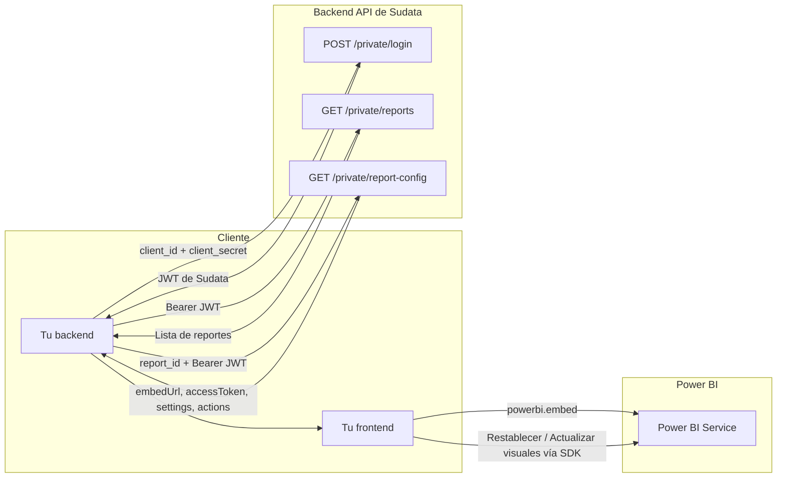

# Sudata PBI — Guía de integración de la API privada de reportes

Guía para autenticar contra la API de Sudata, obtener la configuración de un reporte Power BI y renderizarlo en tu propio sistema. Este repositorio incluye además una aplicación de ejemplo (Flask) y un script que prueba la API de punta a punta.

**Contenido**

1. [Novedades](#novedades)
2. [Cómo funciona](#cómo-funciona)
3. [Referencia de endpoints](#referencia-de-endpoints)
4. [Renderizar con el SDK de Power BI](#renderizar-con-el-sdk-de-power-bi)
5. [Acciones del usuario: Restablecer y Actualizar visuales](#acciones-del-usuario-restablecer-y-actualizar-visuales)
6. [Probar la integración](#probar-la-integración)
7. [Aplicación de ejemplo](#aplicación-de-ejemplo)
8. [Seguridad](#seguridad)
9. [Errores comunes](#errores-comunes)
10. [Checklist de integración](#checklist-de-integración)

---

## Novedades

`GET /private/report-config` devuelve ahora dos bloques adicionales, **`settings`** y **`actions`**:

```json
{
  "settings": { "persistentFiltersEnabled": true },
  "actions":  { "resetToDefault": true, "refreshVisuals": false }
}
```

- **No hay endpoints nuevos.** El cambio es retrocompatible: las claves que ya consumías (`embedUrl`, `reportId`, `accessToken`, `workspaceId`) no cambian, y un cliente que ignore las nuevas sigue funcionando igual.
- `actions` indica qué botones puede ofrecer tu interfaz: **Restablecer** y **Actualizar visuales**.
- Ambas acciones **se ejecutan en el navegador** con el SDK de Power BI (`report.resetPersistentFilters()` y `report.refresh()`) sobre el reporte ya embebido. No hay nada que llamar en la API de Sudata.
- `settings` hay que mezclarlo en la configuración de embed: `persistentFiltersEnabled` solo puede definirse **al cargar** el reporte y es lo que permite que *Restablecer* funcione.
- Cada reporte las tiene habilitadas o no; lo decide el administrador de Sudata (ver [Habilitar las acciones](#habilitar-las-acciones)).

---

## Cómo funciona



1. Tu **backend** se autentica con `POST /private/login` y obtiene un JWT de Sudata.
2. Con el JWT consulta `GET /private/reports` para conocer los reportes de la empresa.
3. Cuando el usuario elige uno, pide `GET /private/report-config?report_id=X`.
4. Tu frontend renderiza con `embedUrl` y `accessToken`, aplica `settings` y muestra los botones que indique `actions`.

> El `client_secret` solo debe vivir en tu backend. Nunca lo envíes al navegador.

### Dos tokens

La integración usa dos tokens con ciclos de vida muy distintos:

| Token | Quién lo emite | Para qué sirve | Duración |
|-------|----------------|----------------|----------|
| **JWT de Sudata** (`access_token` de `/login`) | Sudata | Autenticar las llamadas a la API de Sudata | `expires_in` segundos (normalmente 3600). Se puede cachear |
| **Access Token de Power BI** (`accessToken` de `/report-config`) | Azure AD | Renderizar el reporte en el navegador | Minutos. Pedirlo justo antes de cada render, **nunca almacenarlo** |

---

## Referencia de endpoints

Todas las rutas cuelgan de `API_BASE` (por ejemplo `https://reports.sudata.co/private`). Los errores responden JSON con la forma `{ "error": "mensaje" }`.

### `POST /private/login`

Autentica la empresa y devuelve el JWT de Sudata.

**Request** (`Content-Type: application/json`):

```json
{ "client_id": "tu-client-id", "client_secret": "tu-client-secret" }
```

**Response `200`:**

```json
{ "access_token": "eyJhbGci...", "token_type": "Bearer", "expires_in": 3600 }
```

Usá `access_token` como `Authorization: Bearer ...` en las demás llamadas.

| Estado | `error` | Causa |
|--------|---------|-------|
| 400 | `Request body must be JSON` | El cuerpo no es JSON |
| 400 | `client_id and client_secret are required` | Falta alguno de los dos campos |
| 401 | `Invalid credentials` | `client_id` o `client_secret` incorrectos |
| 403 | `Client is inactive` | La empresa está desactivada |

---

### `GET /private/reports`

Lista los reportes privados asociados a la empresa autenticada.

**Headers:** `Authorization: Bearer {access_token_de_sudata}`

**Response `200`:**

```json
{
  "empresa_id": 3,
  "empresa_nombre": "Mi Empresa SA",
  "reports": [
    { "id": 1, "name": "Reporte Ventas",      "filterable": true  },
    { "id": 2, "name": "Reporte Inventarios", "filterable": false }
  ]
}
```

| Campo | Descripción |
|-------|-------------|
| `id` | Id del reporte en Sudata (entero). Es el `report_id` que se pasa a `/report-config` |
| `name` | Nombre para mostrar |
| `filterable` | `true` si el reporte acepta el parámetro `filter` en `/report-config` |

| Estado | `error` | Causa |
|--------|---------|-------|
| 401 | `Authorization header missing or invalid` | Falta el header o no es `Bearer` |
| 401 | `Token has expired` | El JWT venció: volvé a hacer login |
| 401 | `Invalid token: ...` | El token no es válido |
| 404 | `Empresa not found` | La empresa del token ya no existe |

---

### `GET /private/report-config`

Devuelve lo necesario para embeber un reporte: URL de embed, token de Power BI de corta duración, y los bloques `settings` y `actions`.

**Headers:** `Authorization: Bearer {access_token_de_sudata}`

**Parámetros (query):**

| Parámetro | Obligatorio | Descripción |
|-----------|-------------|-------------|
| `report_id` | Sí | Id del reporte en Sudata (el `id` de `/reports`) |
| `filter` | No | Valor de filtro. Solo se aplica si el reporte es `filterable` (ver abajo) |

**Response `200`:**

```json
{
  "embedUrl": "https://app.powerbi.com/reportEmbed?reportId=8ac22f5b-...&groupId=adf27877-...",
  "reportId": "8ac22f5b-...",
  "accessToken": "eyJ0eXAiOiJKV1Qi...",
  "workspaceId": "adf27877-...",
  "settings": { "persistentFiltersEnabled": true },
  "actions":  { "resetToDefault": true, "refreshVisuals": false }
}
```

| Campo | Tipo | Descripción |
|-------|------|-------------|
| `embedUrl` | string | URL de embed. Con filtro aplicado si corresponde |
| `reportId` | string | GUID del reporte **en Power BI**. Es el `id` de `powerbi.embed` (no confundir con el `report_id` numérico de Sudata) |
| `accessToken` | string | Token de **Azure AD** de Power BI. Vence en minutos |
| `workspaceId` | string | GUID del workspace de Power BI |
| `settings.persistentFiltersEnabled` | boolean | Mezclalo en `settings` de la configuración de embed. Solo se puede definir al cargar |
| `actions.resetToDefault` | boolean | `true` → ofrecer **Restablecer** (`report.resetPersistentFilters()`) |
| `actions.refreshVisuals` | boolean | `true` → ofrecer **Actualizar visuales** (`report.refresh()`) |

`settings.persistentFiltersEnabled` y `actions.resetToDefault` siempre coinciden.

> ⚠️ El `accessToken` vence en minutos: llamá a este endpoint justo antes de cada render y no lo guardes.

**Filtro.** Si el reporte es `filterable` y se envía `filter`, el servidor agrega a `embedUrl` el filtro `Tabla/Campo eq {valor}` (con la tabla y el campo que el administrador configuró para ese reporte). Tené en cuenta:

- El valor **se inserta tal cual**; el servidor no agrega comillas. Para valores numéricos alcanza con `2`; para texto usá la sintaxis de filtros por URL de Power BI (`'USA'`, con comillas simples).
- Si el reporte no es filtrable, o no tiene tabla y campo configurados, el parámetro `filter` **se ignora sin error**.

| Estado | `error` | Causa |
|--------|---------|-------|
| 400 | `report_id is required (query ?report_id= or body JSON)` | Falta `report_id` |
| 401 | `Authorization header missing or invalid` · `Token has expired` · `Invalid token signature.` · `Token format error: ...` · `Invalid token: ...` | Problema con el JWT de Sudata |
| 403 | `Report is not private` | El reporte no está habilitado para la API privada |
| 403 | `Report does not belong to this empresa` | El reporte no pertenece a la empresa autenticada |
| 404 | `Report not found` | No existe un reporte con ese id |
| 500 | `Error generating report embed token` | Falló la obtención del token de Power BI. Reintentá; si persiste, avisá a Sudata |

---

## Renderizar con el SDK de Power BI

El token de `/report-config` es de tipo **AAD**, no un Embed token. Es importante al configurar el SDK:

```html
<script src="https://cdn.jsdelivr.net/npm/powerbi-client@2.23.1/dist/powerbi.min.js"></script>
```

```javascript
const models = window['powerbi-client'].models;

// cfg = respuesta de tu backend a GET /private/report-config
const config = {
  type: 'report',
  tokenType: models.TokenType.Aad,    // AAD, no Embed
  accessToken: cfg.accessToken,
  embedUrl: cfg.embedUrl,
  id: cfg.reportId,
  settings: {
    panes: {
      filters: { visible: false },
      pageNavigation: { visible: true }
    },
    ...cfg.settings                   // persistentFiltersEnabled (necesario para "Restablecer")
  }
};

const report = powerbi.embed(document.getElementById('contenedor'), config);

report.on('loaded', () => {
  console.log('Reporte cargado');
  // mostrar u ocultar los botones según cfg.actions (ver la sección siguiente)
});
report.on('error', (e) => console.error(e.detail));
```

El `contenedor` debe tener dimensiones explícitas (`width` y `height`, o `100%` con altura definida por el padre).

---

## Acciones del usuario: Restablecer y Actualizar visuales

| `actions` | Botón | Llamada del SDK | Qué hace |
|-----------|-------|-----------------|----------|
| `resetToDefault` | **Restablecer** | `report.resetPersistentFilters()` | Devuelve filtros, segmentaciones y otros cambios de vista al estado por defecto del reporte |
| `refreshVisuals` | **Actualizar visuales** | `report.refresh()` | Refresca los objetos visuales con los datos más recientes, sin perder filtros ni interacciones |

```javascript
const actions = cfg.actions || {};

resetBtn.hidden   = !actions.resetToDefault;
refreshBtn.hidden = !actions.refreshVisuals;

resetBtn.onclick = async () => {
  try {
    const result = await report.resetPersistentFilters();
    console.log('resetPersistentFilters:', result);
  } catch (e) {
    console.error('resetPersistentFilters falló:', e);
  }
};

refreshBtn.onclick = async () => {
  try {
    await report.refresh();
    console.log('refresh: ok');
  } catch (e) {
    console.error('refresh falló:', e);
  }
};
```

**Reglas para tu interfaz**

- Mostrá cada botón **solo si** su acción viene en `true`. Si está en `false`, la llamada del SDK puede fallar o no hacer nada.
- Mostrá los botones cuando el reporte termine de cargar (evento `loaded`).
- No son llamadas a la API de Sudata: no hay nada que enviar al servidor.

**Notas del comportamiento (según la documentación de Microsoft)**

- **Restablecer** usa *filtros persistentes*. Por eso `persistentFiltersEnabled` debe estar en `true` **al cargar** el reporte y no se puede cambiar después: para cambiarlo hay que destruir el embed (`powerbi.reset(contenedor)`) y volver a embeber. Requiere `tokenType: Aad`.
- Con filtros persistentes habilitados, Power BI guarda el estado de filtros y segmentaciones del usuario automáticamente (aproximadamente a los 60 segundos de actividad) y lo restaura la próxima vez que se abre el reporte. *Restablecer* vuelve al estado por defecto del reporte.
- **Actualizar visuales** (`report.refresh()`) refresca los datos subyacentes de los objetos visuales sin resetear filtros ni interacciones, pero **solo trae datos nuevos en modelos DirectQuery**. En modelos Import, los datos cambian cuando se actualiza el modelo semántico; esa actualización no se dispara desde esta API.

### Habilitar las acciones

Las acciones se activan **por reporte** desde el backoffice de Sudata (edición del reporte → *Acciones para usuarios*):

| Opción del backoffice | Efecto en `/report-config` |
|-----------------------|----------------------------|
| Permitir restablecer a valores predeterminados | `actions.resetToDefault` y `settings.persistentFiltersEnabled` en `true` |
| Permitir actualizar objetos visuales | `actions.refreshVisuals` en `true` |

Si una acción debería estar disponible y viene en `false`, pedile al administrador de Sudata que la habilite para ese reporte. Para que *Restablecer* funcione, el reporte debe tener los filtros persistentes habilitados en Power BI y la aplicación de Azure AD debe tener el permiso `UserState.ReadWrite.All`; el administrador de Sudata se encarga de eso.

---

## Probar la integración

### 1. Con el script (sin navegador)

`test_endpoints.py` recorre la API con tus credenciales: login, lista de reportes, y para cada reporte comprueba que `/report-config` devuelva todo lo necesario para renderizar (incluido que el `accessToken` de Power BI esté vigente) y los bloques `settings` y `actions`. También prueba los casos de error (secret incorrecto, sin token, reporte inexistente).

Requisitos: Python 3.9 o superior y `pip install requests`.

```bash
cp .env_example .env        # y completá API_BASE, CLIENT_ID y CLIENT_SECRET
python test_endpoints.py
```

| Opción | Para qué sirve |
|--------|----------------|
| `--report-id 3` | Probar solo ese reporte |
| `--filter 2` | Además probar el filtro en los reportes filtrables |
| `--legacy` | Servidor sin esta actualización: no exige `settings` ni `actions` |
| `--no-negative` | Omitir las pruebas de error (credenciales falsas, sin token) |
| `--base URL` / `--env-file RUTA` | Usar otra URL base u otro archivo de configuración |

Ejemplo de salida:

```
Sudata PBI - prueba de la API privada
Base   : https://reports.sudata.co/private
Cliente: abc123...   secret: ********   (config: archivo .env)

[1] POST /login
  OK    login con las credenciales del .env  (token Bearer, vence en 60 min)
  OK    secret incorrecto -> 401
  OK    cuerpo vacio -> 400

[2] GET /reports
  OK    lista de reportes con token valido
  OK    estructura correcta para la empresa "Mi Empresa SA"  (2 reportes)
          - id=1  Reporte Ventas  filterable=True
          - id=2  Reporte Inventarios  filterable=False
...
[3] GET /report-config?report_id=1   (Reporte Ventas)
  OK    configuracion de embed
  OK    trae embedUrl, reportId, accessToken y workspaceId
  OK    el accessToken de Power BI esta vigente  (vence en 60 min)
  OK    settings.persistentFiltersEnabled y actions.{resetToDefault, refreshVisuals} son booleanos  (reset=True, refreshVisuals=False)
  OK    persistentFiltersEnabled coincide con resetToDefault ...

Resumen: 24 ok, 0 fallas, 0 avisos
```

El script **nunca imprime el secret ni los tokens**. Código de salida: `0` todo bien, `1` hubo fallas, `2` falta configuración.

### 2. En el navegador (para probar los botones)

*Restablecer* y *Actualizar visuales* se ejecutan en el navegador, así que se prueban con la aplicación de ejemplo:

```bash
pip install -r requirements.txt
python app.py
```

Abrí `http://127.0.0.1:5000`, elegí un reporte y, si tiene acciones habilitadas, vas a ver los botones **arriba a la derecha**, en la franja del título. Cada clic registra el resultado en la consola del navegador (F12 → Consola).

---

## Aplicación de ejemplo

```
├── app.py                # Backend Flask: proxy hacia la API de Sudata
├── templates/index.html  # Frontend: lista de reportes, filtro, embed y botones de acciones
├── test_endpoints.py     # Prueba de la API de punta a punta
├── .env_example          # Plantilla de configuración
└── requirements.txt
```

### Variables de entorno (`.env`)

| Variable | Descripción | Valor por defecto |
|----------|-------------|-------------------|
| `API_BASE` | URL base de la API (termina en `/private`) | `https://reports.sudata.co/private` |
| `CLIENT_ID` | Client ID de la empresa | — |
| `CLIENT_SECRET` | Client Secret de la empresa | — |
| `SECRET_KEY` | Clave para firmar la sesión de Flask | `dev-secret` |

`app.py` y `test_endpoints.py` leen el archivo `.env` de esta carpeta; una variable de entorno ya definida tiene prioridad.

### Rutas del backend de ejemplo

| Ruta | Descripción |
|------|-------------|
| `GET /` | Sirve el dashboard |
| `GET /api/reports` | Proxy a `/private/reports` |
| `GET /api/report-config?report_id=X[&filter=...]` | Proxy a `/private/report-config` (siempre pide un token nuevo) |

El JWT de Sudata se cachea en la sesión de Flask y se renueva automáticamente si la API responde `401`. Las credenciales quedan en el backend: el navegador solo habla con estas rutas.

---

## Seguridad

- **El `client_secret` vive solo en tu backend.** No lo pongas en código del navegador, en repositorios ni en logs.
- No subas el `.env` a git (este repositorio ya lo ignora). Para compartir el proyecto, usá git, no una carpeta comprimida: el `.env` iría adentro.
- Si sospechás que el secret se expuso, pedile a Sudata que genere uno nuevo.
- El `accessToken` de Power BI da acceso al reporte: no lo guardes, no lo registres y pedilo en cada render.
- Para las acciones del usuario no hace falta exponer nada más: se ejecutan con el SDK sobre el reporte que ya embebiste.

---

## Errores comunes

| Síntoma | Causa y solución |
|---------|------------------|
| `LoadReportFailed` | El `accessToken` de Power BI venció o es inválido. Llamá a `/report-config` otra vez justo antes de embeber |
| Token rechazado por el SDK | El token es **AAD**: usá `models.TokenType.Aad`, no `TokenType.Embed` |
| `401` en `/login` | `client_id` o `client_secret` incorrectos |
| `403` en `/login` | La empresa está desactivada: contactá a Sudata |
| `401 Token has expired` | Venció el JWT de Sudata: hacé login de nuevo |
| `403 Report does not belong to this empresa` | Estás pidiendo un reporte que no figura en tu `/reports` |
| Reporte en blanco sin error | El contenedor HTML no tiene altura definida |
| No aparecen los botones | El reporte no tiene la acción habilitada (`actions` en `false`) o el reporte todavía no terminó de cargar |
| *Restablecer* falla | `persistentFiltersEnabled` no estaba en `true` al cargar, o falta habilitar los filtros persistentes y el permiso `UserState.ReadWrite.All` (lo gestiona el administrador de Sudata). Revisá el error en la consola |
| *Actualizar visuales* no cambia los datos | Esperado en modelos Import: `report.refresh()` solo trae datos nuevos en DirectQuery |
| `/report-config` no trae `settings` ni `actions` | El servidor todavía no tiene la actualización. Usá `python test_endpoints.py --legacy` |

---

## Checklist de integración

- [ ] El backend hace login y cachea el JWT de Sudata; renueva ante un `401`.
- [ ] El `client_secret` no sale del backend.
- [ ] `/report-config` se llama justo antes de cada render; el `accessToken` no se guarda.
- [ ] `powerbi.embed` usa `tokenType: Aad`, `embedUrl`, `reportId` como `id`, y mezcla `cfg.settings`.
- [ ] Los botones se muestran según `cfg.actions` y solo cuando el reporte terminó de cargar.
- [ ] Los errores de las acciones se capturan y se muestran o registran.
- [ ] Ejecutaste `python test_endpoints.py` y da `0 fallas`.
